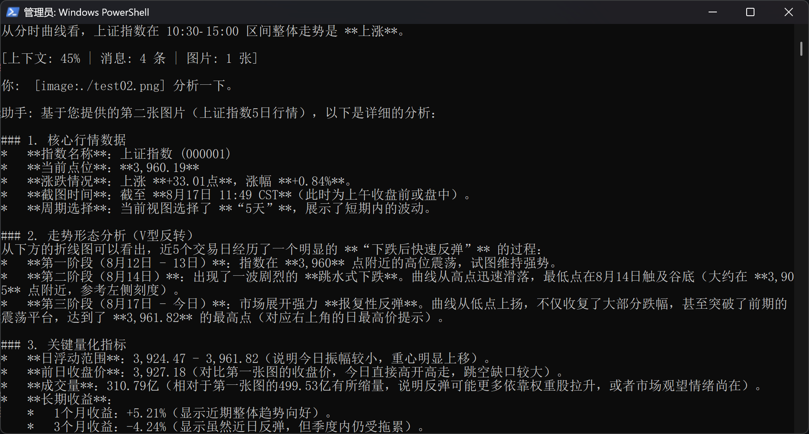
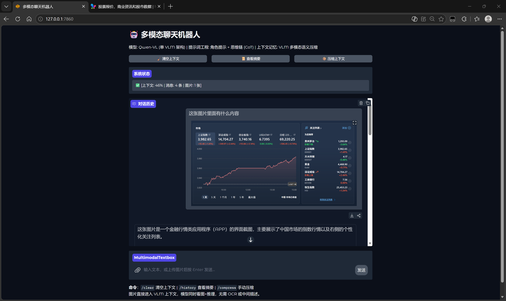

# 多模态聊天机器人 项目文档

***

## 一、项目概述

一个支持**纯文本**和**图片**双模态输入的智能聊天机器人，提供 CLI 命令行界面和 Gradio Web 界面两种交互方式。

**核心特点：**

- **单 VLM 架构**：Qwen-VL 多模态模型统一处理文本推理和图片理解
- **零 LLM 框架**：所有模型调用均通过原生 `requests` HTTP 请求实现，不依赖 LangChain、LlamaIndex 等
- **上下文记忆与语义压缩**：上下文超 80% 时自动压缩，压缩时 VLM 直接看图产出语义摘要，图片退场但语义保留
- **提示词工程**：角色提示 + 思维链 ，适配多模态消息格式

***

## 二、运行界面

### CLI 命令行界面



### Gradio Web 界面



***

## 三、项目结构

```
Chat_Bot/
├── main.py                    # CLI 入口
├── web.py                     # Gradio Web 界面入口
├── config.py                  # 全局配置
├── .env                       # 环境变量配置文件
├── img/                       # 截图等资源
└── core/
    ├── model_client.py        # 模型调用层（Qwen-VL 单模型，纯 HTTP）
    ├── context_manager.py     # 上下文记忆管理（VLM 多模态语义压缩）
    └── prompt_builder.py      # 提示词构建（角色提示 + 思维链）
```

***

## 四、技术栈

| 模块     | 介绍                                      |
| ------ | --------------------------------------- |
| 编程语言   | Python                                  |
| 模型     | Qwen-VL (多模态)                           |
| API 调用 | requests（纯 HTTP）                        |
| 上下文记忆  | VLM 多模态语义压缩，产出语义摘要                      |
| 提示词工程  | 角色提示 + 思维链                              |
| Web 界面 | Gradio   Chatbot + MultimodalTextbox 组件 |
| 图片输入   | 多模态 image\_url，图片输入                     |

***

## 五、上下文与压缩

### 5.1 上下文

`ContextManager` 负责保存和管理对话消息（含 image\_url），追踪 token 使用量。`PromptBuilder` 负责将上下文消息组装为最终发送给模型的 messages 列表：最前面注入 system 角色提示，如有历史摘要则以 system 消息注入，接着按时间顺序排列对话消息，并在最后一条 user 消息末尾追加思维链指令。每轮对话结束后显示上下文使用率、消息条数和图片张数。

### 5.2 压缩方案

当上下文使用率达到 80% 时自动触发压缩，或通过 `/compress` 命令手动触发。压缩时保留最近约 40% token 预算的原文+原图（单条消息容忍上限 60%），将其余旧消息（含图片）整体发给 VLM 生成语义摘要。VLM 在压缩时直接看图，输出对话语义摘要（而非图片内容描述）。摘要以 system 消息注入到新上下文最前面，旧摘要与新内容合并时去重去矛盾，重写为一段连贯摘要。

***

## 六、模型配置

### 6.1 环境变量配置

| 环境变量                  | 说明                 |
| --------------------- | ------------------ |
| `QWEN_API_KEY`        | **—**              |
| `QWEN_BASE_URL`       | API 地址             |
| `QWEN_MODEL`          | 模型名称               |
| `QWEN_MAX_TOKENS`     | 最大输出 token         |
| `QWEN_TEMPERATURE`    | 温度（0-1，越高越随机）      |
| `QWEN_CONTEXT_WINDOW` | 模型上下文窗口大小（token 数） |
| `SUMMARY_MAX_TOKENS`  | 压缩时摘要输出的最大 token 数 |

<br />

***

## 七、项目特点

| 特点       | 说明                                        |
| -------- | ----------------------------------------- |
| 零框架      | 不依赖 LangChain、LlamaIndex 等任何 LLM 框架       |
| 单 VLM 架构 | 一个模型处理文本推理和图片理解，无需 OCR 中间层                |
| 多模态语义压缩  | VLM 压缩时直接看图，产出语义摘要                        |
| 可配置压缩策略  | 80% 硬触发 + 手动 `/compress`，保留窗口 40%\~60% 可调 |
| 上下文可视化   | 每轮对话后显示使用率、消息条数、图片张数                      |
| 双界面      | CLI 命令行 + Gradio Web 界面                   |
| 提示词工程    | 角色提示 + 思维链两项提示词工程                         |

